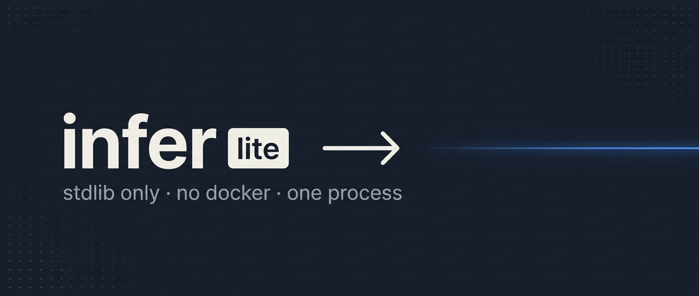

<p align="center">
  
</p>

<h1 align="center">infer-lite</h1>

<p align="center">
  <strong>Minimum viable architecture: stdlib-only LLM gateway.</strong><br>
  No Docker. No LiteLLM. One Python file, one provider catalog, one HTTP server.
</p>

<p align="center">
  <a href="LICENSE"></a>
  
  
  
</p>

---

## Quickstart

```bash
# 1. Install
git clone https://github.com/bradAGI/infer-lite && cd infer-lite
# or:  npx skills add bradagi/infer-lite

# 2. Add free keys
./infer keys add gemini AIza...
./infer keys add nvidia nvapi-...
./infer keys add openrouter sk-or-...

# 3. Boot the server (foreground; Ctrl-C to stop)
./infer serve

# 4. Verify what works for your account (in another terminal)
./infer probe

# 5. Wire your coding agents (any combination)
./infer wire cc | opencode | pi | openclaw | hermes

# 6. (optional) Make the command run from anywhere
./infer install            # symlinks ~/.local/bin/infer → this script
infer doctor               # works from any directory
```

`./infer install` detects your shell (bash / zsh / fish on macOS and Linux) and prints the right `~/.zshrc` / `~/.bashrc` / `~/.config/fish/config.fish` line if `~/.local/bin` isn't on `$PATH`. `./infer uninstall` removes the symlink. Pass `--name <other>` to install under a different command name.

> **Permission denied?** If `./infer` errors with "Permission denied" right after clone or skill install, the executable bit didn't survive the transfer. Run `chmod +x infer` once and you're set.

## Use it

```bash
curl http://localhost:4000/v1/chat/completions \
  -H "Content-Type: application/json" \
  -d '{"model": "gemini-2.5-flash", "messages": [{"role": "user", "content": "hi"}]}'

curl http://localhost:4000/v1/embeddings \
  -H "Content-Type: application/json" \
  -d '{"model": "gemini-embedding-001", "input": "vectorize me"}'

curl http://localhost:4000/v1/models | jq '.data[].id'
```

OpenAI SDK works unchanged:

```python
from openai import OpenAI
client = OpenAI(base_url="http://localhost:4000/v1", api_key="anything")
client.chat.completions.create(model="gemini-2.5-flash",
    messages=[{"role": "user", "content": "Hello"}])
```

`api_key` is required by the SDK but ignored by the gateway — the real provider key is stored server-side in `~/.config/infer/keys.env`.

## Architecture

```
infer (single Python file, stdlib only)
 ├── http.server bound to 127.0.0.1:4000
 │    ├── GET  /v1/models                → list catalog aliases
 │    ├── POST /v1/chat/completions      → forward to <upstream>/chat/completions
 │    ├── POST /v1/embeddings            → forward to <upstream>/embeddings
 │    └── GET  /health                   → liveness
 ├── ~/.config/infer/keys.env            → API keys (chmod 600)
 ├── providers.toml                      → catalog (base_url + key_env per provider)
 └── per-request: lookup alias → grab key → forward → stream SSE through
```

That's the whole gateway. ~700 LOC.

**What this is:** the simplest thing that takes an OpenAI-shape request, looks up which upstream provider the model alias points at, attaches your key, and forwards. SSE streams pump straight through. Provider catalog is data, the script is logic.

**Lost vs `bradAGI/fi-gateway`** (the LiteLLM-backed sibling):
- `/v1/messages` (Anthropic shape) — not implemented; Claude Code wires call this so it 404s without it
- Sophisticated rate-limit-aware routing — replaced with simple round-robin across multiple keys per provider
- Cohere/Vertex/Bedrock and other non-OpenAI-shape providers — only OpenAI-compatible providers in the catalog
- Container-isolated proxy — the server runs as a process

**Kept:**
- Discovery for OpenRouter (free-priced), NVIDIA NIM, Gemini AI Studio
- Probe + auto-prune on `./infer sync`
- Wire/unwire/detect for cc / opencode / pi / openclaw / hermes
- Install/uninstall PATH symlink
- Doctor health overview

## Commands

```
./infer serve [--bind ADDR] [--port N]   Run the gateway (foreground)
./infer doctor                           Health + active providers + probe + drift
./infer install [--name N] [--dir D]     Symlink into a $PATH dir
./infer uninstall

./infer keys add <provider> <key>
./infer keys list
./infer keys remove <provider> [--index N]

./infer providers                        Active vs inactive
./infer models [-g GROUP] [-w | --broken]
./infer sync                             Refresh auto-discovered catalogs
./infer probe [-g GROUP] [-p PROVIDER] [-c N] [-t SEC]

./infer detect                           Scan installed agent CLIs
./infer wire <cc|opencode|pi|openclaw|hermes>
./infer unwire <cc|opencode|pi|openclaw|hermes>
```

## Auto-discovery

| Kind | Source | Cache |
|------|--------|-------|
| `openrouter_free` | `openrouter.ai/api/v1/models` filtered to `pricing.prompt == 0` | 24h |
| `nvidia_nim` | `integrate.api.nvidia.com/v1/models` | 24h |
| `gemini` | `generativelanguage.googleapis.com/v1beta/openai/models` | 24h |

Each handler classifies discovered ids into `chat / embed / rerank / drop`. Image/video/audio/parser endpoints are dropped. Embedding models stay tagged `embed` and probe via `/v1/embeddings`.

## Adding a provider

```toml
[[provider]]
name = "your-provider"
key_env = "YOURPROVIDER_API_KEY"
base_url = "https://api.yours.example/v1"   # OpenAI-compatible endpoint
optional_key = false                         # true for keyless providers

[[provider.model]]
alias = "yours-flagship"
upstream = "their/model-id"
groups = ["smart", "vision"]
```

Then `./infer keys add your-provider <key>` and restart `serve`.

## Background it

```bash
nohup ./infer serve > ~/.config/infer/serve.log 2>&1 &
echo $! > ~/.config/infer/serve.pid
```

To stop: `kill "$(cat ~/.config/infer/serve.pid)"`.

(For full process supervision use systemd / launchd — the script is a plain Python process.)

## When to use the heavier sibling

[`bradAGI/fi-gateway`](https://github.com/bradAGI/fi-gateway) keeps a LiteLLM-in-Docker proxy and adds `/v1/messages` (Anthropic shape), pricing-aware routing, and 80+ providers including Cohere/Vertex/Bedrock. Use it when:

- A wired client expects `/v1/messages` (Claude Code's full feature surface).
- You need providers that aren't OpenAI-shape.
- You want LiteLLM's rate-limit router rather than basic round-robin.

For the common "I want my coding agents to use my free Gemini/NVIDIA/OpenRouter keys", **lite is enough**.

## Caveats

- **`/v1/messages` is not implemented** — Anthropic SDK clients pointed at this gateway will 404. Use the OpenAI SDK shape, or use `bradAGI/fi-gateway`.
- **`./infer serve` blocks** — to background it use `nohup` or a process supervisor.
- **No master key** — the gateway accepts any `Authorization` header on localhost. Don't bind to `0.0.0.0` without putting auth in front.
- **NVIDIA NIM gating** — many endpoints require per-account approval and silently 404. Probe catches this.

## License

MIT
